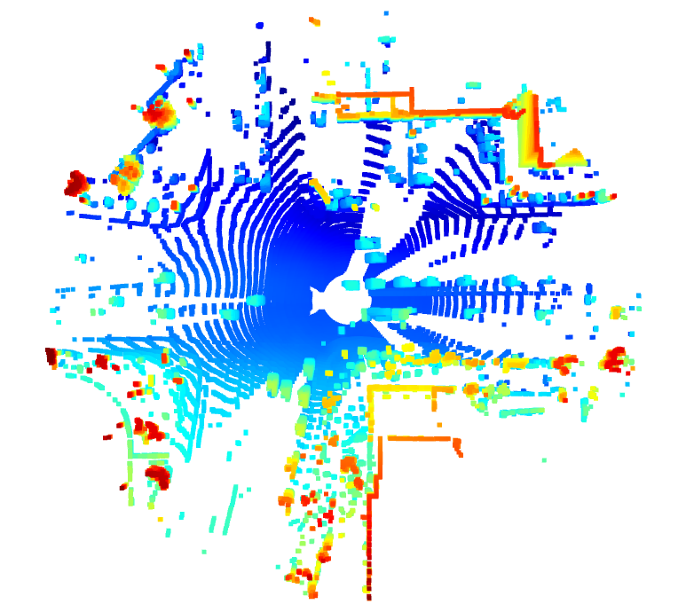
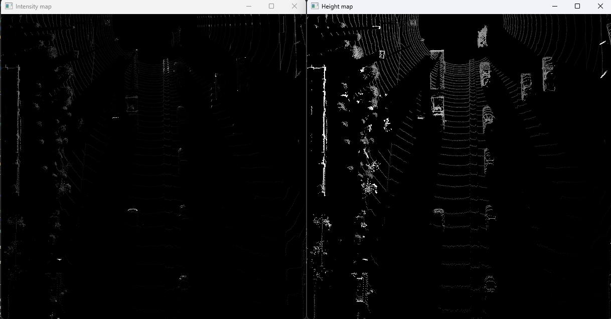
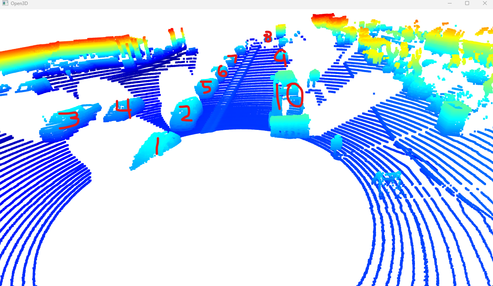
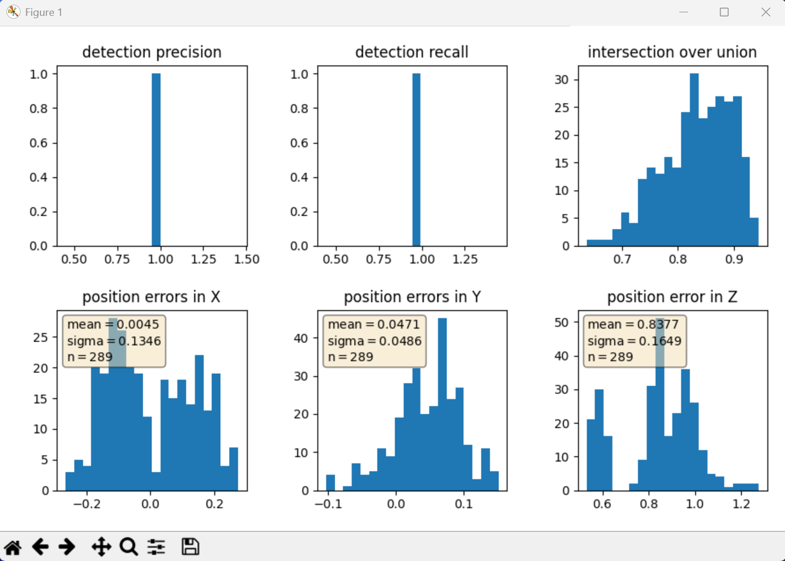

# Writeup: Track 3D-Objects Over Time

### 1. Write a short recap of the four tracking steps and what you implemented there (filter, track management, association, camera fusion). Which results did you achieve? Which part of the project was most difficult for you to complete, and why?

The first step we implmented was computing a lidar point-cloud given a range image. To achieve this step we had to visualize the range image channels and then construct the lidar point-cloud and visualize that as well. Step 2 was about creating a birds eye view from the lidar pcl we created in the previous step. The main reason for this step is for humans to better visualize the scene and help detect the objects better as they are better separated from this vantage point. Once we created the BEV map we also had to identify the intensity and height layers of the map. In step 3 we introduced the SFA3D model, a type of fpn_resnet model, to help illustrate how to integrate a new model to an existing framework. We also had to extract 3D bounding boxes from the model response of the original data. Lastly, in step 4, we evaluated the performace of our model by calculating intersection-over-union, false-negatives, false-positives, precision, and recall, as well as plotting all this data.


### 2. Do you see any benefits in camera-lidar fusion compared to lidar-only tracking (in theory and in your concrete results)?

Yes, I do see benefits. Camera-lidar fusion help offset each others weaknesses because cameras are good at detecting objects and lidar is good at detecting depth and distance. Together these 2 help improve the accuracy of our system. The results also prove this point as the precision and recall were both very high, above 90% for me. Therefore, I do believe that camera-lidar fusion is better than lidar-only tracking.


### 3. Which challenges will a sensor fusion system face in real-life scenarios? Did you see any of these challenges in the project?

In real-life scenarios, it can be difficult to calibrate sensors to ensure their measurements are aligned with each other. This can be difficult in environments where sensors may be moving or vibrating quite frequently. And while computational comlexity wasn't as big of a challenge in this project, it can be in real-life scenarios where results need to be produce almost instantaneously to ensure safe decisions.


### 4. Can you think of ways to improve your tracking results in the future?


The obvious answer would be to use more data, but that isn't always plausible. I would also probably look into using different models and considering the tradeoffs to improve my tracking results, even though they were already pretty high this time.


### Visualize point-cloud (ID_S1_EX2)



This is the top down birds eye view of the map. Notice the big white circle in the middle is the self driving vehicle capturing data. Any other white in the image shows region where the camera-lidar wasn't able to see anything as there might have been something constructing its vision. For example, directly to the right of the car, there are regions of white spreading off in a linear fashion. This is most likely due to vehicles in its way.



Here we see the intensity channel and height map for the image. This was a necessary step because if we only had the intensity channel our model wouldn't really be able to make out any objects. Hence we had to normalize the intensity channel by the difference between the max and min height defined. The height map allows us to better detect and visualize the objects, both graphically and visually as humans. 



Here I have picked out 10 vehicles. Some interesting features to note are cars 1 and 4. They seem to be cut off a little bit. Number 1 is most likely cut off because it is in the blind spot of the vehicle capturing data. And 4 is cut off because vehicle 1 cuts it off. Vehicle 3 is clearly a pickup truck of some sort. Then cars 2, 5-8, and 9 are a bit hard to read as they are farther away from the vehicle. The other cool vehicle I noticed was vehicle 10. It seems to be hauling a trailer with it. I think this because the second part of the car doesn't really look like a car, and it's more raised in the rear, leading me to believe it is a trailer atached to a pickup truck.

Some vehicle parts being rendered are the side mirrors in vehicle 2. I notice a small rectangle sticking out to the left of vehicle 2, indicating it is the side mirror. I also see a side mirror to the left of vehcile 10. It's very faint but I also see small white rectangles in the fronts of the vehicles. I assume these to be license plates. Other than that it is a little difficult finding concrete features as these features tend to be pretty small and point clouds aren't designed to capture that minute level of detail, making it tough to distinguish them from other objects in the cloud.



And lastly here is my precision-recall plots. It demostrates the precision, recall, iou, and position errors in the x, y, and z directions of the model.


# Part 2: Final Project
## The necessary images for this part are under the ```img``` folder, named ```step1.png```, ```step2.png```, ```step3.png```, and ```step4.png```.

### Write a short recap of the four tracking steps and what you implemented there. Which results did you achieve? Which part of the project was most difficult for you to complete, and why?

In this part we were tasked with doing four things. First was implementing an Extended Kalman Filter to track single real-world targets with lidar measurements over time. Second was implementing track management to initialize and delete tracks, setting a track state, and a track score. Third, we implemented a single nearest neighbor data association to assiciate measurements to tracks. This was the start of multi target tracking! Lastly, to complete camera-lidar fusion, we implemented teh nonlinear camera measurement model. I resulted in low RMSE values for multi tracking, but high RMSE for single tracking. This is because the Kalman filter cannot compensate for the systematic offset the lidar detections contain. For me, part 3 was the toughest because that was the concept I was least sure about. It took a lot more rewatching the videos and doing outside research for me to complete that part.


### Do you see any benefits in camera-lidar fusion compared to lidar-only tracking (in theory and in your concrete results)?
Camera-Lidar fusion brings improved accuracy and robustness. That's because they have complementary strengths and weaknesses. Unfortunately, my results don't show this as I got similar results for lidar-only and camera-lidar. Camera sensors also bring with them extended range. This was evident in my findings because camera settings detected objects farther away than lidar-only.


### Which challenges will a sensor fusion system face in real-life scenarios? Did you see any of these challenges in the project?
In real life there may be senor noise and errors. We saw this in part 2 with the high RMSE value for single object tracking because lidar detections contained a y offset. Another challenge is computational complexity. Since we are computing on lidar and camera images, it will take longer to compute. This was also evident in part 4, where we were processing each frame a little slower. 


### Can you think of ways to improve your tracking results in the future?
One way could be to fine tune my paramterization by applying standard deviation values for lidar. I could also implement a more advanced data association such as Global Nearest Neighbor or Joint Probabilistic Data Association. I could also adapt the Kalman filter to estimate the object's width, length, and height. 
